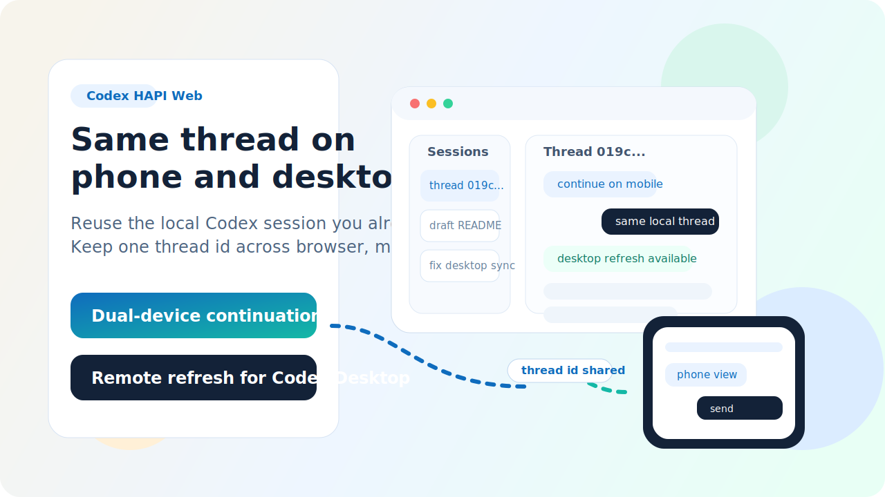
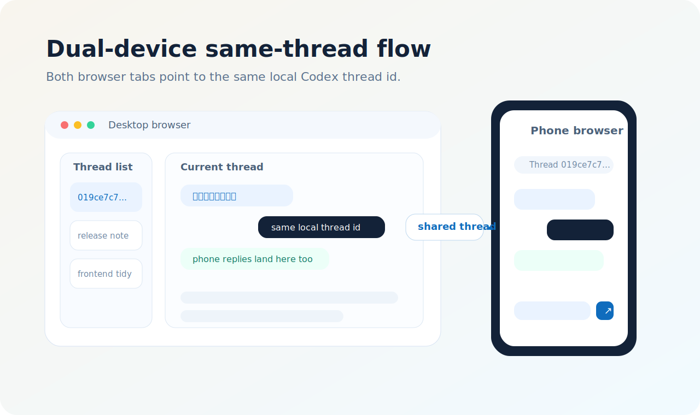
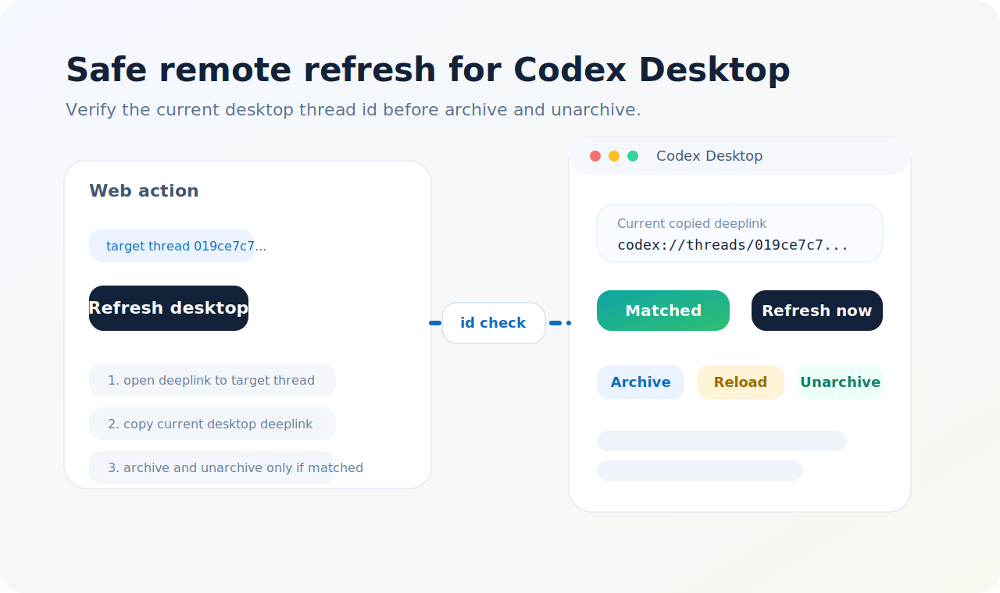

# Codex HAPI Web



把本机 Codex 会话接到手机和电脑浏览器里的轻量 Web 控制台。

它最突出的两件事：

- 双端同一会话：手机、电脑浏览器、Codex Desktop 共享同一个本地线程 id
- 远程刷新桌面端：网页写入新消息后，可安全触发官方 Codex Desktop 重载目标线程

这不是一个“再造聊天系统”的 AI 壳，而是把你已经在本机使用的 Codex 工作流延伸到浏览器和手机上，继续同一条线程、继续同一份上下文。

## 为什么它和普通 Web 包装不一样

- 不重建会话层，直接复用本机 `~/.codex/sessions`
- 手机和电脑打开同一条线程时，看到的是同一份本地 Codex 历史
- 针对 Windows 提供桌面端远程刷新，不用靠整应用重启来补消息
- 保留文件上传、移动端适配和可选语音转写

## 界面预览

### 1. 双端同一会话



同一个线程 id 可以同时在电脑浏览器和手机浏览器里继续对话，消息最终都落到本机同一条 Codex 线程。

### 2. 远程刷新 Codex Desktop



当官方 Codex Desktop 没有自动补出网页侧写入的最新消息时，可以通过目标线程校验后执行“归档 + 取消归档”刷新桌面端视图。

## 核心能力

- 会话列表和消息详情页
- 浏览器里继续已有 Codex 线程
- 双端同一线程接力
- Windows 桌面线程远程刷新
- 文件上传
- 可选语音转写
- 移动端适配

## 项目结构

```text
.
|-- backend/
|-- frontend/
|-- scripts/
|-- voice-local/
|-- docs/
|-- .env.example
|-- docker-compose.voice-local.yml
```

## 运行前提

- Windows 主机
- 已安装并可用的 Codex Desktop
- 本机已有 `~/.codex/sessions`
- 可连接的本地 Codex `app-server`
- Python 3.11+
- `uv`
- PowerShell

可选：

- Node.js 20+
  用于前端开发和重新构建 `frontend/dist`。如果仓库里已经带好可用的 `frontend/dist`，纯运行后端时可以不依赖 Node.js。
- Docker
  用于启动本地语音转写后端
- Tailscale
  用于手机通过 Tailnet 直接访问
- Cloudflare Tunnel
  用于公网访问

## 快速开始

### 1. 复制环境配置

把 `.env.example` 复制为 `.env`，再按需修改：

```powershell
Copy-Item .\.env.example .\.env
```

关键变量：

- `CODEX_HAPI_HOST`
- `CODEX_HAPI_PORT`
- `CODEX_APP_SERVER_URL`
- `CODEX_HOME`
- `CODEX_HAPI_VOICE_BACKEND`
- `CODEX_HAPI_DESKTOP_REFRESH_SCRIPT`

如果你暂时不需要语音，建议直接设置：

```env
CODEX_HAPI_VOICE_BACKEND=none
```

### 2. 初始化依赖

```powershell
powershell -ExecutionPolicy Bypass -File .\scripts\bootstrap.ps1
```

这个脚本会处理前端依赖和构建产物。

### 3. 启动整套服务

```powershell
powershell -ExecutionPolicy Bypass -File .\scripts\start-stack.ps1
```

如果不想启动本地语音后端：

```powershell
powershell -ExecutionPolicy Bypass -File .\scripts\start-stack.ps1 -SkipVoiceLocal
```

启动后默认访问：

- [http://127.0.0.1:3113](http://127.0.0.1:3113)

辅助脚本：

- 状态查看：[scripts/status-stack.ps1](./scripts/status-stack.ps1)
- 停止服务：[scripts/stop-stack.ps1](./scripts/stop-stack.ps1)
- 仅启动后端：[scripts/start-backend.ps1](./scripts/start-backend.ps1)

## 如何实现双端同一会话

这套项目没有自己再造一套“网页会话系统”，而是直接复用 Codex 本机已有线程。

工作方式是：

1. 后端扫描 `CODEX_HOME/sessions`
2. 从本地会话文件中提取线程 id、标题、摘要和消息
3. 网页端继续提问时，消息被发送到同一个本地 Codex 线程 id
4. 因此电脑端、手机端、网页端、本地 Codex 本质上都在操作同一条线程

要实现“双端同一会话”，你只需要：

1. 让手机和电脑都访问这套网页
2. 在两端打开同一个线程 id
3. 后续消息都继续发到这条线程

注意：

- 线程共享的是本机 Codex 会话，不是网页自己维护的独立会话
- 所以真正的事实来源仍然是你本地 `~/.codex/sessions/*.jsonl`
- 官方 Codex Desktop 有时不会自动热刷新外部写入的消息，这时需要用下面的“远程刷新桌面端”

## 如何实现远程刷新桌面端

### 背景

官方 Codex Desktop 目前没有公开的“强制重扫当前线程”接口。

实测可用的刷新链路是：

1. 先让 Codex Desktop 切到目标线程
2. 对该线程执行一次归档
3. 再取消归档
4. 桌面 UI 会重新加载该线程内容

### 本项目的做法

远程刷新由 [scripts/refresh-desktop-thread.ps1](./scripts/refresh-desktop-thread.ps1) 完成，核心逻辑是：

1. 通过桌面主程序 `app\Codex.exe` 打开目标线程 deeplink
2. 通过deeplink锁定当前线程id，执行刷新
3. 执行归档和取消归档，触发桌面端重新加载消息


### 为什么现在比早期版本更安全

早期方案的问题是：如果切线程失败，脚本可能继续对“当前停留页”做归档。

现在这版增加了线程 id 级别校验：

- deeplink 只负责“尝试切到目标线程”
- 剪贴板读回的当前线程 id 负责“验证是否真的切对”
- 如果没切到目标线程，脚本会直接停止，不会归档错页

### 使用前提

- 仅支持 Windows
- 本机必须已启动 Codex Desktop
- Codex Desktop 需要能被 PowerShell UI 自动化拿到焦点
- 线程刷新依赖当前桌面 UI 结构，未来如果官方桌面改版，脚本可能需要调整

## 语音转写

### 本地语音后端

可使用仓库内置的本地转写服务：

- [docs/VOICE_LOCAL.md](./docs/VOICE_LOCAL.md)
- [voice-local/](./voice-local)

### OpenAI 转写

如果要走 OpenAI：

```env
CODEX_HAPI_VOICE_BACKEND=openai
OPENAI_API_KEY=...
OPENAI_TRANSCRIPTION_MODEL=gpt-4o-mini-transcribe
```

## 远程访问

### Tailscale

适合“自己远程访问自己的电脑”：

- [docs/TAILSCALE.md](./docs/TAILSCALE.md)
- [scripts/show-tailscale-url.ps1](./scripts/show-tailscale-url.ps1)

### Cloudflare Tunnel

适合需要更正式的公网入口：

- [docs/CLOUDFLARE_TUNNEL.md](./docs/CLOUDFLARE_TUNNEL.md)
- [scripts/install-cloudflared.ps1](./scripts/install-cloudflared.ps1)
- [scripts/start-cloudflare-tunnel.ps1](./scripts/start-cloudflare-tunnel.ps1)
- [scripts/install-cloudflare-service.ps1](./scripts/install-cloudflare-service.ps1)

### 临时公网测试

- [scripts/start-trycloudflare.ps1](./scripts/start-trycloudflare.ps1)
- [scripts/start-trycloudflare-detached.ps1](./scripts/start-trycloudflare-detached.ps1)
- [scripts/start-localtunnel.ps1](./scripts/start-localtunnel.ps1)

## 安全边界

这套项目本质上是在远程继续操作你本机上的 Codex。

这意味着：

- 网页里发出的消息，最终会进入你自己的本地 Codex 线程
- 上传的文件路径和消息内容，可能影响本机工作区
- 如果把这套服务直接暴露到公网，就必须自己负责访问控制和网络边界

建议：

- 优先使用 Tailscale 之类的私网方式
- 公网暴露时至少加一层你自己可控的访问保护
- 不要把这套服务当成多租户公开机器人

## 当前限制

- 桌面刷新是 Windows 专属能力
- 语音转写依赖本地语音后端或 OpenAI API
- 官方 Codex Desktop 对外部消息写入的热刷新并不稳定，所以才需要额外的“远程刷新”
- UI 自动化依赖当前桌面界面结构，桌面版本变化后可能需要跟进调整

## 更多文档

- [docs/ARCHITECTURE.md](./docs/ARCHITECTURE.md)
- [docs/VOICE_LOCAL.md](./docs/VOICE_LOCAL.md)
- [docs/CLOUDFLARE_TUNNEL.md](./docs/CLOUDFLARE_TUNNEL.md)
- [docs/TAILSCALE.md](./docs/TAILSCALE.md)
- [docs/GITHUB_PUBLISH.md](./docs/GITHUB_PUBLISH.md)
